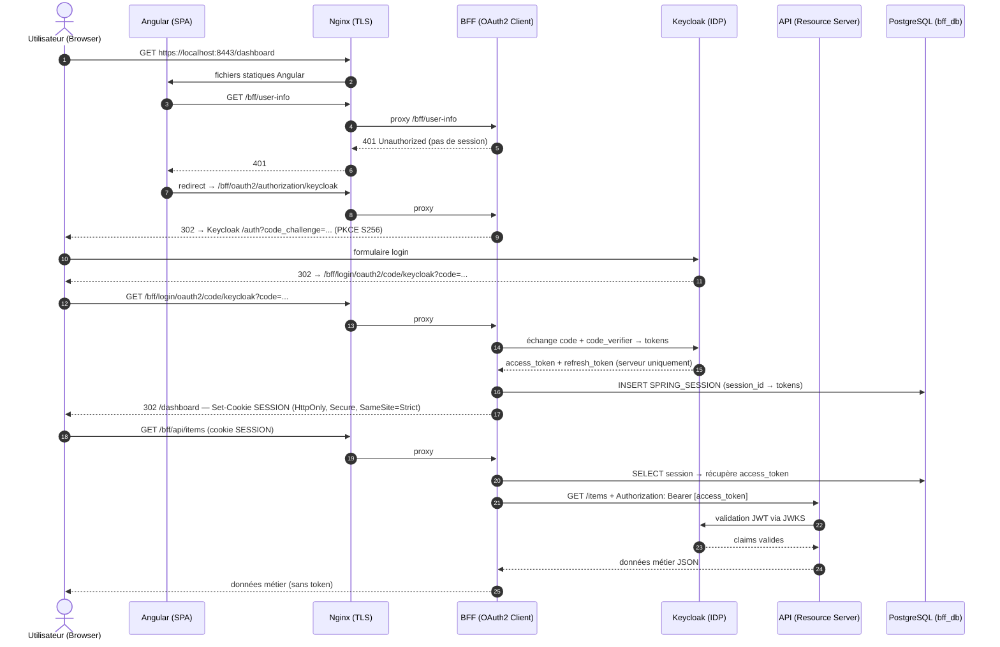

# Enterprise App — Angular + Spring Boot + Keycloak

Application d'entreprise full-stack sécurisée avec authentification OIDC.  
**Principe fondateur : le token OAuth2 ne transite jamais vers le navigateur** (pattern BFF).

## Stack technique

| Couche | Technologie |
|---|---|
| Frontend | Angular 19 (standalone components) |
| BFF | Spring Boot 4.0 — OAuth2 Client + Spring Session JDBC |
| API | Spring Boot 4.0 — OAuth2 Resource Server + Flyway |
| Identité | Keycloak 26 (OIDC) |
| Base de données | PostgreSQL 16 (3 bases sur 1 instance) |
| Reverse proxy | Nginx (TLS, headers de sécurité) |
| Orchestration | Docker Compose |

---

## Démarrage rapide

### Prérequis

- [Docker Desktop](https://www.docker.com/products/docker-desktop/) ≥ 24
- [mkcert](https://github.com/FiloSottile/mkcert) (certificats TLS locaux)
- `make` (inclus sur macOS/Linux)

### 1. Initialisation

```bash
make setup        # copie .env.example → .env + génère les certificats TLS
# Éditer .env et remplacer les valeurs changeme_*
```

### 2. Démarrage

```bash
make up
```

Accès : **https://localhost:8443**

Comptes de test (créés automatiquement) :

| Utilisateur | Mot de passe | Rôles |
|---|---|---|
| `user@example.com` | `user1234` | USER |
| `admin@example.com` | `admin1234` | USER, ADMIN |

---

## Architecture

```
Browser (Angular)
    │  cookie SESSION — HttpOnly / Secure / SameSite=Strict
    ▼
nginx (TLS :443)
    ├── /          → frontend (Angular/Nginx)
    └── /bff/**    → bff (Spring Boot — OAuth2 Client)
                         │  Bearer token injecté côté serveur
                         ▼
                    api (Spring Boot — Resource Server)
                         │  valide JWT via JWKS Keycloak
                         ▼
                    keycloak (IDP OIDC)

postgres (instance unique)
├── keycloak_db  → Keycloak
├── bff_db       → Sessions Spring (SPRING_SESSION)
└── api_db       → données métier (items)
```

**Réseaux Docker** :
- `frontend-net` : nginx ↔ bff ↔ frontend
- `backend-net` : bff ↔ api ↔ keycloak ↔ postgres

L'API et Keycloak ne sont **jamais** exposés sur le réseau frontend ni sur l'hôte.

---

## Flux de sécurité



---

## Principes de sécurité

| # | Principe | Détail technique |
|---|---|---|
| 1 | **Token jamais exposé au navigateur** | Pattern BFF : les tokens OAuth2 sont stockés exclusivement côté serveur. Le browser reçoit uniquement un cookie de session opaque. |
| 2 | **Authorization Code Flow + PKCE** | Seul ce flow est autorisé dans Keycloak. PKCE (S256) protège contre l'interception du code. Implicit Flow et Direct Grant sont désactivés. |
| 3 | **Cookie HttpOnly / Secure / SameSite=Strict** | HttpOnly : inaccessible à JavaScript (XSS). Secure : HTTPS uniquement. SameSite=Strict : refusé en cross-site (CSRF). |
| 4 | **Protection CSRF double-submit cookie** | Le BFF émet `XSRF-TOKEN` (non HttpOnly). Angular le lit et l'envoie dans `X-XSRF-TOKEN`. Le BFF valide la cohérence des deux valeurs. |
| 5 | **Sessions en base de données (Spring Session JDBC)** | Les sessions BFF sont persistées dans `bff_db` via les tables `SPRING_SESSION` / `SPRING_SESSION_ATTRIBUTES`. Résistant aux redémarrages. |
| 6 | **Refresh token rotation** | Keycloak invalide le refresh token après chaque utilisation. Détecte la réutilisation d'un token volé. |
| 7 | **Révocation explicite au logout** | Le BFF appelle le endpoint de révocation Keycloak avant d'invalider la session locale. Le token est immédiatement inutilisable. |
| 8 | **Validation JWT par JWKS** | L'API valide la signature de chaque Bearer token auprès du JWKS Keycloak. Aucune clé statique partagée — la rotation des clés est automatique. |
| 9 | **Isolation réseau Docker** | L'API et Keycloak sont uniquement sur `backend-net`. Nginx n'expose que le port 443. Le browser ne peut pas atteindre l'API directement. |
| 10 | **TLS de bout en bout** | Nginx termine le TLS (certificat valide). Les communications inter-services restent sur le réseau privé Docker. |
| 11 | **Headers de sécurité HTTP** | `Strict-Transport-Security`, `Content-Security-Policy`, `X-Frame-Options: DENY`, `X-Content-Type-Options`, `Referrer-Policy: no-referrer` sur toutes les réponses Nginx. |
| 12 | **Secrets externalisés** | Aucun secret dans le code source. Tout est injecté via `.env` (exclu de git par `.gitignore`). |

---

## Structure du projet

```
.
├── Makefile                   # Commandes du projet (make help)
├── docker-compose.yml         # Orchestration des 6 services
├── .env.example               # Template des variables d'environnement
├── .gitignore
│
├── postgres/
│   └── init.sql               # Création des 3 bases et utilisateurs
│
├── keycloak/
│   └── realm-export.json      # Realm, clients, rôles, utilisateurs de test
│
├── nginx/
│   ├── nginx.conf             # Reverse proxy TLS + headers sécurité
│   └── certs/                 # Certificats TLS (générés par mkcert)
│
├── bff/                       # Spring Boot — OAuth2 Client
│   ├── Dockerfile
│   ├── pom.xml
│   └── src/main/java/.../
│       ├── config/
│       │   ├── SecurityConfig.java    # CSRF, oauth2Login, logout OIDC
│       │   └── WebClientConfig.java   # WebClient avec injection Bearer
│       ├── proxy/
│       │   └── ApiProxyController.java  # Proxy /api/** → API backend
│       └── web/
│           └── UserInfoController.java  # GET /user-info (claims sans token)
│
├── api/                       # Spring Boot — Resource Server
│   ├── Dockerfile
│   ├── pom.xml
│   └── src/main/
│       ├── java/.../
│       │   ├── config/SecurityConfig.java   # JWT + extraction rôles Keycloak
│       │   ├── controller/ItemController.java
│       │   ├── entity/Item.java
│       │   └── repository/ItemRepository.java
│       └── resources/
│           └── db/migration/V1__init.sql    # Flyway — schéma initial
│
└── frontend/                  # Angular 19
    ├── Dockerfile             # Multi-stage : ng build + Nginx
    ├── nginx.conf
    └── src/app/
        ├── core/
        │   ├── guards/auth.guard.ts           # Vérifie session via /bff/user-info
        │   ├── interceptors/csrf.interceptor.ts  # Double-submit CSRF
        │   └── services/auth.service.ts        # Login/logout sans token
        └── features/dashboard/                # Page principale
```

---

## Développement local

### Commandes Make

```
make help          # Liste toutes les commandes disponibles
```

| Catégorie | Commande | Description |
|---|---|---|
| **Init** | `make setup` | Initialisation complète (env + certificats) |
| | `make env` | Copie `.env.example` → `.env` |
| | `make certs` | Génère les certificats TLS avec mkcert |
| **Services** | `make up` | Démarre tous les services |
| | `make down` | Arrête tous les services |
| | `make restart` | Redémarre tous les services |
| | `make build` | Reconstruit les images |
| | `make ps` | État des services |
| **Logs** | `make logs` | Logs de tous les services |
| | `make logs-bff` | Logs du BFF |
| | `make logs-api` | Logs de l'API |
| | `make logs-kc` | Logs de Keycloak |
| | `make logs-nginx` | Logs de Nginx |
| **Base de données** | `make sessions` | Sessions BFF actives (Spring Session) |
| | `make psql-bff` | Shell psql sur `bff_db` |
| | `make psql-api` | Shell psql sur `api_db` |
| | `make psql-kc` | Shell psql sur `keycloak_db` |
| **Keycloak** | `make kc-export` | Exporte le realm vers `keycloak/` |
| **Nettoyage** | `make clean` | Arrête les services et supprime les volumes |
| | `make nuke` | Supprime tout (volumes, images, certificats) |

### Ajouter un utilisateur Keycloak

Modifier `keycloak/realm-export.json` dans le tableau `users`, puis relancer :

```bash
docker compose rm -sf keycloak && make up
```
